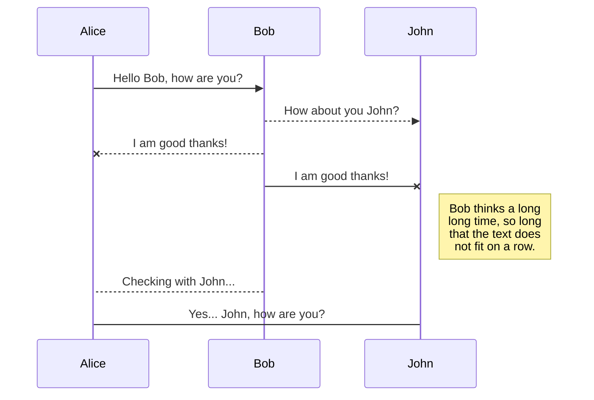
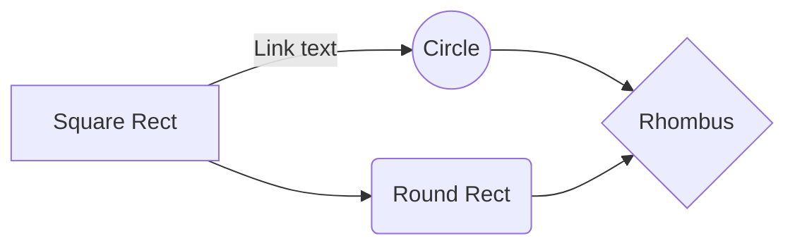

# DATA SET BOSTON

Se realiza analisis **Regresion lineal**histogramas diferentes analisis 

# VISUALIZACION DE DATOS

<image src="http://imgfz.com/i/LkWa1vo.png" alt="Descripción de la imagen">
<image src="http://imgfz.com/i/Ka9LYlZ.png" alt="Descripción de la imagen">
<image src="http://imgfz.com/i/e5LfH3p.png" alt="Descripción de la imagen">

## SmartyPants

SmartyPants converts ASCII punctuation characters into "smart" typographic punctuation HTML entities. For example:

|                |ASCII                          |HTML                         |
|----------------|-------------------------------|-----------------------------|
|Single backticks|`'Isn't this fun?'`            |'Isn't this fun?'            |
|Quotes          |`"Isn't this fun?"`            |"Isn't this fun?"            |
|Dashes          |`-- is en-dash, --- is em-dash`|-- is en-dash, --- is em-dash|

## KaTeX

The *Gamma function* satisfying $\Gamma(n) = (n-1)!\quad\forall n\in\mathbb N$ is via the Euler integral

$$
\Gamma(z) = \int_0^\infty t^{z-1}e^{-t}dt\,.
$$

## UML diagrams

And this will produce a flow chart:

